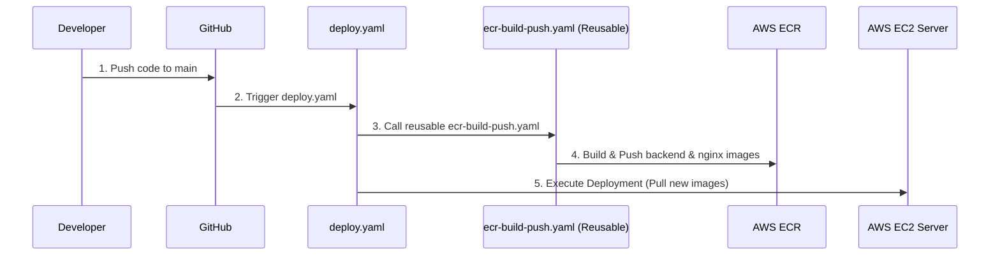

<div align="center">
  <h1>🚀 Lost & Found Platform (Enterprise Edition)</h1>
  <p>A full-stack, cloud-native application featuring automated Infrastructure as Code (Terraform) and robust GitHub Actions CI/CD pipelines deployed to AWS EC2.</p>

  <!-- Badges -->
  <p>
    
    
    
    
    
    
    
    
    
    
    
    
  </p>
</div>

---

## 📑 Table of Contents
1. [Project Overview](#-project-overview)
2. [Features & Version History](#-features--version-history)
3. [Architecture](#-architecture)
4. [CI/CD & GitOps Workflows](#-cicd--gitops-workflows)
5. [Infrastructure as Code (Terraform)](#%EF%B8%8F-infrastructure-as-code-terraform)
6. [Extreme Beginner Guide: Installation & Setup](#-extreme-beginner-guide-installation--setup)
    - [Method 1: Local Development (Docker Compose)](#method-1-local-development-docker-compose--easiest)
    - [Method 2: Cloud Deployment (Terraform to AWS)](#method-2-cloud-deployment-terraform-to-aws--enterprise)
7. [API Endpoints](#-api-endpoints)
8. [Screenshots](#-screenshots)
9. [Contributing](#-contributing)
10. [License](#-license)

---

## 📖 Project Overview

The **Lost & Found Platform** is a scalable, full-stack web application designed to help users report lost items, find misplaced belongings, and seamlessly claim them. 

Evolving from a monolithic application into a highly automated, cloud-native enterprise project, the platform now boasts **Infrastructure as Code (IaC)** via Terraform and fully automated **GitHub Actions CI/CD pipelines** that deploy seamlessly to AWS EC2.

---

## ✨ Features & Version History

- **V1 & V2 (Application Base):** JWT Authentication, robust claim system with approval/rejection workflows, dynamic user dashboard, and a vanilla JavaScript frontend over a Django REST backend.
- **V3 (Containerization & Local K8s):** Complete Dockerization and production-grade Nginx reverse proxy routing. Introduction of Kubernetes (KIND) for local testing.
- **V4 (DevSecOps):** Automated DevSecOps pipelines (Trivy, OWASP, SonarQube) for security and code quality gates.
- **🚀 V5 (Enterprise Automation & IaC):** 
  - **Terraform Integration:** One-command automated provisioning of the entire AWS infrastructure, including EC2 servers, Security Groups, remote state management, and Elastic Container Registries (ECR).
  - **GitHub Actions CI/CD:** Highly modular, reusable workflows (`ecr-build-push.yaml`) pushing Docker images to ECR, followed by automated deployments to the EC2 instances.

---

## 🏗️ Architecture

The platform utilizes an automated **Terraform to EC2** architecture. The infrastructure (EC2, ECR) is completely codified, and deployments are handled by GitHub Actions pushing images to ECR and updating the EC2 server.

```mermaid
flowchart TB
    Client([👤 Client/User]) -->|HTTP/HTTPS| NGINX[Nginx Reverse Proxy]
    
    subgraph AWS Cloud [AWS Infrastructure (Terraform Provisioned)]
        subgraph AWS ECR [Elastic Container Registry]
            BackendRepo[lost-found/backend]
            NginxRepo[lost-found/nginx]
        end
        
        subgraph AWS EC2 [AWS EC2 Instance]
            NGINX --> Frontend[Frontend Assets]
            NGINX --> API[Django REST API]
            
            API <--> Auth[Accounts Module]
            API <--> Reports[Lost & Found Module]
            
            API --> DB[(SQLite DB)]
        end
    end
    
    BackendRepo -.->|Pulled via CI / User Data| API
    NginxRepo -.->|Pulled via CI / User Data| NGINX
```

**Repository Structure:** Contains application logic (Django, Vanilla JS), `Dockerfile`, `docker-compose.yml`, Terraform IaC (`main.tf`, `ecr.tf`, etc.), and modular GitHub Actions workflows.

<details>
<summary><b>📂 View Full Project Structure</b></summary>

```text
Lost-and-Found-Platform-Django.git/
├── .github/
│   └── workflows/
│       ├── deploy.yaml
│       └── ecr-build-push.yaml
├── .gitignore
├── Dockerfile
├── JenkinsFile
├── LostFoundProject/
│   ├── __init__.py
│   ├── asgi.py
│   ├── settings.py
│   ├── urls.py
│   └── wsgi.py
├── README.md
├── accounts/
│   ├── __init__.py
│   ├── admin.py
│   ├── apps.py
│   ├── migrations/
│   │   └── __init__.py
│   ├── models.py
│   ├── tests.py
│   ├── urls.py
│   └── views.py
├── api/
│   ├── __init__.py
│   ├── admin.py
│   ├── apps.py
│   ├── migrations/
│   │   └── __init__.py
│   ├── models.py
│   ├── serializer.py
│   ├── tests.py
│   ├── urls.py
│   └── views.py
├── docker-compose.yml
├── frontend/
│   ├── __init__.py
│   ├── admin.py
│   ├── apps.py
│   ├── migrations/
│   │   └── __init__.py
│   ├── models.py
│   ├── templates/
│   │   ├── base.html
│   │   ├── dashboard.html
│   │   ├── found_detail.html
│   │   ├── home.html
│   │   ├── login.html
│   │   ├── lost_detail.html
│   │   ├── my_reports.html
│   │   ├── privacy_policy.html
│   │   ├── report_found.html
│   │   ├── report_lost.html
│   │   ├── sign_up.html
│   │   └── terms_of_service.html
│   ├── tests.py
│   ├── urls.py
│   └── views.py
├── manage.py
├── nginx/
│   ├── Dockerfile
│   └── default.conf
├── reports/
│   ├── __init__.py
│   ├── admin.py
│   ├── apps.py
│   ├── migrations/
│   │   ├── 0001_initial.py
│   │   ├── 0002_founditem_alter_lostitems_location.py
│   │   ├── 0003_founditem_category_lostitems_category.py
│   │   ├── 0004_founditem_user_lostitems_user.py
│   │   ├── 0005_claim.py
│   │   ├── 0006_remove_claim_claimant_user_remove_claim_message_and_more.py
│   │   ├── 0007_remove_founditem_finder_email_and_more.py
│   │   └── __init__.py
│   ├── models.py
│   ├── tests.py
│   ├── urls.py
│   ├── utils.py
│   └── views.py
├── requirements.txt
├── screenshots/
│   ├── Screenshot from 2026-05-09 18-57-45.png
│   ├── Screenshot from 2026-05-09 18-57-58.png
│   ├── Screenshot from 2026-05-09 18-58-06.png
│   ├── Screenshot from 2026-05-09 18-58-13.png
│   ├── Screenshot from 2026-05-09 18-58-42.png
│   ├── Screenshot from 2026-05-09 18-59-04.png
│   ├── Screenshot from 2026-05-09 19-00-14.png
│   ├── Screenshot from 2026-05-09 19-04-35.png
│   └── Screenshot from 2026-05-09 19-14-36.png
├── terraform/
│   ├── .terraform.lock.hcl
│   ├── ec2-infra/
│   │   ├── User_data-ec2.sh
│   │   ├── ec2.tf
│   │   ├── iam.tf
│   │   ├── outputs.tf
│   │   └── variables.tf
│   ├── main.tf
│   ├── outputs.tf
│   ├── providers.tf
│   ├── remote-backend/
│   │   ├── .terraform.lock.hcl
│   │   ├── dynamodb.tf
│   │   ├── providers.tf
│   │   ├── s3.tf
│   │   └── terraform.tf
│   └── terraform.tf
```
</details>

---

## 🚀 CI/CD Workflows (GitHub Actions)

This project utilizes cutting-edge automation to take code from a developer's machine to the EC2 server with zero manual intervention, relying exclusively on modular GitHub Actions.



### 1. Reusable Workflow Architecture
Located in `.github/workflows/`, our automated CI/CD pipelines trigger upon code pushes to the `main` branch:
- **Modular Design (`deploy.yaml` & `ecr-build-push.yaml`):** By utilizing reusable workflows, we drastically reduce code duplication. The parent `deploy.yaml` orchestrates the process by passing parameters (like `service_name` and `docker_context`) into the generic `ecr-build-push.yaml`. This builds the `backend` and `nginx` Docker images cleanly and in parallel.
- **Benefits of Reusable YAMLs:** 
  - **Maintainability:** Updating the build logic in one file automatically updates it for all microservices.
  - **Consistency:** Ensures every service is built, tagged, and pushed using the exact same DevSecOps standards.

### 2. Continuous Delivery (EC2)
- **Direct ECR Integration:** The pipeline securely authenticates with AWS using GitHub Secrets and pushes the newly tagged images directly to the Elastic Container Registries automatically provisioned by Terraform.
- **Automated Deployments:** Following a successful push to ECR, the pipeline handles deploying those updated images directly to the running EC2 instance.
- **Configuration:** You only need to configure your GitHub Repository Secrets (`AWS_ACCESS_KEY_ID`, `AWS_SECRET_ACCESS_KEY`, `AWS_REGION`, and `AWS_ECR_REGISTRY`) and the pipeline handles the rest automatically.

---

## 🏗️ Infrastructure as Code (Terraform)

This project utilizes Terraform to automate the provisioning of the *entire* AWS cloud infrastructure. Rather than manually clicking through the AWS Console, your compute and storage environments are defined in code.

**The "One-Command" Setup:**
With a single `terraform init && terraform apply`, Terraform will automatically provision:
1. **Compute Infrastructure (`ec2-infra` module):** The AWS EC2 instances, security groups, and networking rules. Utilizing modular Terraform blocks keeps the infrastructure code clean, highly reusable, and easy to extend.
2. **Container Registries (`ecr.tf`):** The exact AWS Elastic Container Registries (`lost-found/backend` and `lost-found/nginx`) required by the GitHub Actions pipelines.

**Benefits of this Setup:**
- **Modularity & Reusability:** Just like our GitHub Actions, structuring Terraform into modules (`ec2-infra`) allows us to cleanly reuse the same infrastructure logic across different environments (dev/prod) without duplicating code.
- **Fully Automated Lifecycle:** Because Terraform creates the ECR repositories automatically, you only need to configure your GitHub secrets to achieve a fully operational deployment pipeline from scratch.
- **Automated ECR Cleanup Policies:** We utilize `aws_ecr_lifecycle_policy` to automatically expire older Docker images (keeping only the last 5), completely preventing storage bloat and saving AWS costs over time.
- **Remote State Management:** We use an S3 Bucket and DynamoDB table to store the Terraform state file remotely. This prevents state corruption, enables state locking, and allows multiple DevOps engineers to collaborate safely.
- **Security First:** SSH keys are generated locally and explicitly ignored by Git, ensuring zero credential leakage into version control.
- **Principle of Least Privilege:** The EC2 instances are provisioned with strictly scoped IAM roles (`iam.tf`) granting *only* the specific permissions required to pull images from ECR, maximizing security.
- **Cost Control:** A single command (`terraform destroy`) cleanly tears down the EC2 instances, ECR repositories, and networking rules when testing is complete.

---

## 🏁 Extreme Beginner Guide: Installation & Setup

Whether you are a developer looking to write code or a DevOps enthusiast deploying to the cloud, follow these step-by-step guides.

### Method 1: Local Development (Docker Compose) — *Easiest*
If you just want to run the app locally, edit code, and see changes without dealing with cloud infrastructure, use this method.

**Prerequisites:** 
- Install [Docker](https://docs.docker.com/get-docker/) and [Docker Compose](https://docs.docker.com/compose/install/).

**Step-by-step:**
1. **Clone the repository:**
   ```bash
   git clone https://github.com/Parth2496Singh/Lost-and-Found-Platform-V2.git
   cd Lost-and-Found-Platform-V2
   ```
2. **Build and start the application:**
   ```bash
   docker-compose up -d --build
   ```
3. **Verify it's running:**
   Open your web browser and navigate to `http://localhost`. To stop the app, run `docker-compose down`.

---

### Method 2: Cloud Deployment (Terraform to AWS) — *Enterprise*

**1. Configure AWS CLI**
Ensure you have the AWS CLI installed, then authenticate with your IAM user credentials:
```bash
aws configure
```
*(Provide your Access Key, Secret Key, and default region when prompted).*

**2. Generate Infrastructure SSH Keys**
We generate a dedicated `ed25519` SSH key pair strictly for this EC2 deployment. Run this command from the root of the project to generate the keys directly inside the terraform directory:
```bash
ssh-keygen -t ed25519 -f ./terraform/terraform-ec2-key -C "aws-ec2-deployments"
```
*(Note: These files are included in the `.gitignore` to prevent accidental commits).*

Copy the generated keys into the remote backend folder so they are available during the state bootstrapping phase:
```bash
cp ./terraform/terraform-ec2-key ./terraform/remote-backend/
cp ./terraform/terraform-ec2-key.pub ./terraform/remote-backend/
```

**3. Bootstrap the Remote State**
Before we build the server, we must build the "vault" that holds our Terraform state (S3 and DynamoDB).
```bash
cd terraform/remote-backend
terraform init
terraform apply -auto-approve
```

**4. Provision the Microservices Environment**
Now that the remote state is configured, deploy the actual application infrastructure.
```bash
cd ..
terraform init
terraform apply -auto-approve
```
Once complete, Terraform will output the public IP address of your new EC2 instance. The EC2 User Data script will automatically install Docker, clone the application code, and spin up the microservices network.

**🧹 Teardown (Destroying Infrastructure)**
To stop incurring AWS charges, destroy the infrastructure when you are done testing. From the `terraform/` directory, run:
```bash
terraform destroy -auto-approve
```
*(Note: You will also need to run this inside `terraform/remote-backend/` if you wish to destroy the S3 bucket and DynamoDB locking table).*

---

### Method 3: Local Kubernetes (KIND) Setup

If you want to deploy and test the application locally using Kubernetes (KIND) and GitOps (ArgoCD), those configurations have been abstracted into our dedicated GitOps repository to maintain a clean architecture.

👉 **Refer to the GitOps Repository for local K8s instructions:**  
[https://github.com/Parth2496Singh/Lost-and-Found-GitOps](https://github.com/Parth2496Singh/Lost-and-Found-GitOps)

---

## 🔌 API Endpoints

The backend is built with Django REST Framework. Here are the core endpoints:

| Endpoint | Method | Description | Auth Required |
|----------|--------|-------------|---------------|
| `/api/lost-items/` | GET / POST | List or report a lost item | Yes |
| `/api/found-items/` | GET / POST | List or report a found item | Yes |
| `/api/claims/` | GET / POST | View or submit a claim | Yes |
| `/api/claims/<id>/approve/` | POST | Approve an active claim | Yes (Admin) |
| `/api/token/` | POST | Login / Obtain JWT token | No |

---

## 📸 Screenshots

*A glimpse into the user interface and platform monitoring.*

<details>
<summary><b>Click to Expand Screenshots</b></summary>
<br>

**Home Page**  


**User Dashboard**  


**Grafana Observability**  


**Kubernetes Pods**  


</details>

---

## 🤝 Contributing

We welcome contributions from the community! To get started:
1. Fork the repository.
2. Create your feature branch (`git checkout -b feature/AmazingFeature`).
3. Commit your changes (`git commit -m 'Add some AmazingFeature'`).
4. Push to the branch (`git push origin feature/AmazingFeature`).
5. Open a Pull Request.

---

## 📄 License

This project is open-source and available under standard open-source principles. Primarily intended for educational and portfolio demonstration purposes.

<div align="center">
  <b>Built with ❤️ by the DevOps Community</b>
</div>
